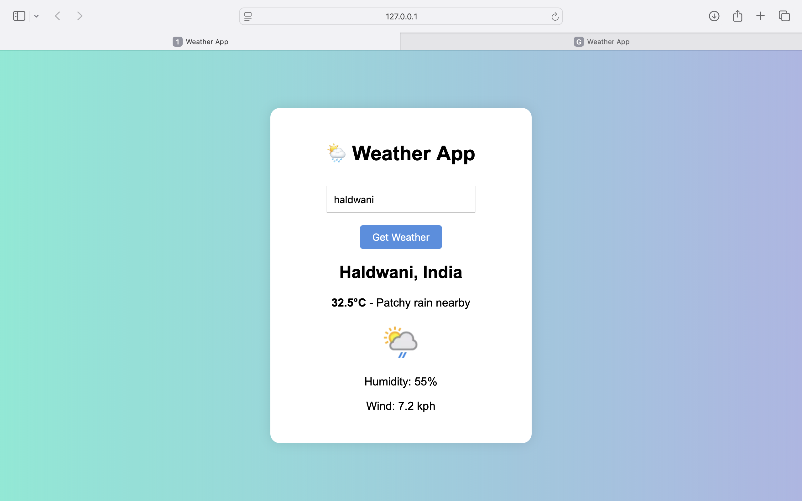

# 🌦️ Weather App

A simple weather application built using **HTML**, **CSS**, and **JavaScript**, powered by **WeatherAPI**. Users can enter any city and view the current weather conditions.

---

## 🔧 Features

- 🌍 Fetches real-time weather data from WeatherAPI
- 📍 Shows city, country, temperature, condition, humidity, and wind speed
- 🌤 Displays weather icons
- 💡 Responsive and clean user interface

---

## 🚀 Demo




---

## 🛠 Tech Stack

- **Frontend**: HTML5, CSS3, Vanilla JavaScript
- **API**: [WeatherAPI](https://api.weatherapi.com/v1) 

---

## 📦 Setup Instructions

1. Clone the repository:
   ```bash
   git clone https://github.com/ankitadhikari1/weather-app.git
   cd weather-app
   ```

2. Open `script.js` and replace:

   ```js
   'key': 'YOUR_API_KEY'
   ```

   with your actual **RapidAPI Key**.

3. Open `index.html` in your browser to run the app.

---

## 📄 API Reference

- **Base URL**: `https://api.weatherapi.com/v1/current.json`
- **Query Params**:
  - `q`: city name (e.g., `London`, `Delhi`)

Headers:

```http
key: YOUR_API_KEY
host: api.weatherapi.com/v1
```

---

## 📁 Project Structure

```
weather-app/
│
├── index.html      # Main HTML file
├── style.css       # Styling
├── script.js       # JavaScript logic
└── README.md       # Project details
```

---

## ✅ Future Improvements

- Add 5-day forecast
- Show sunrise/sunset time
- Use geolocation to get user’s current city
- Improve UI with animations

---

## 📜 License

This project is open source and available under the [MIT License](LICENSE).
